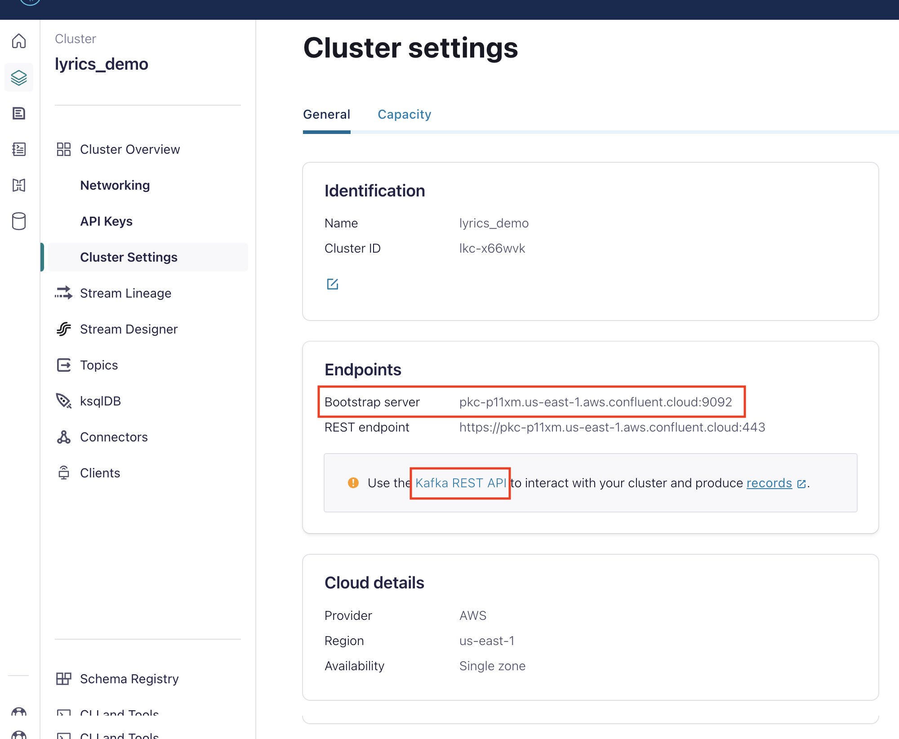
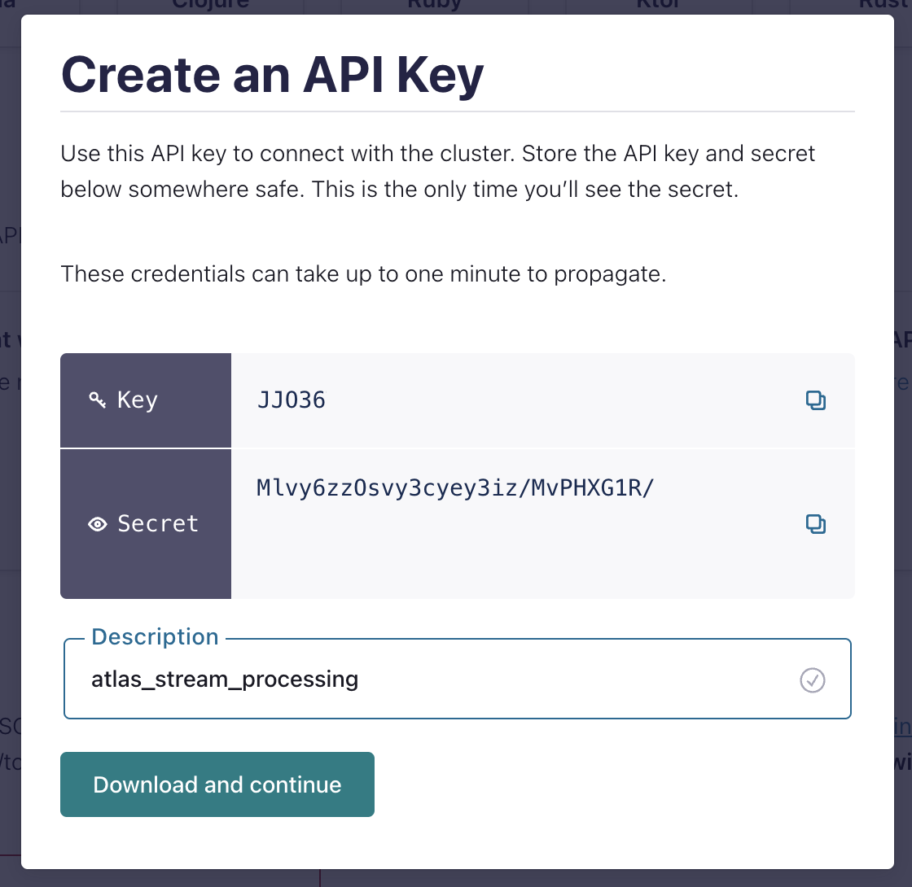
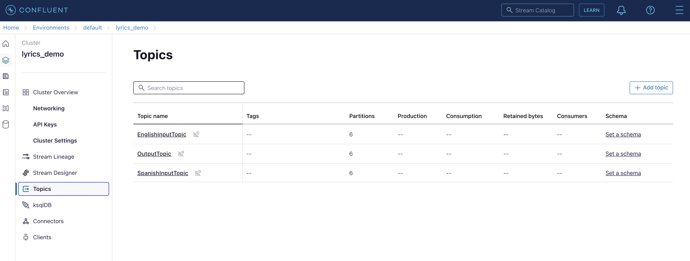
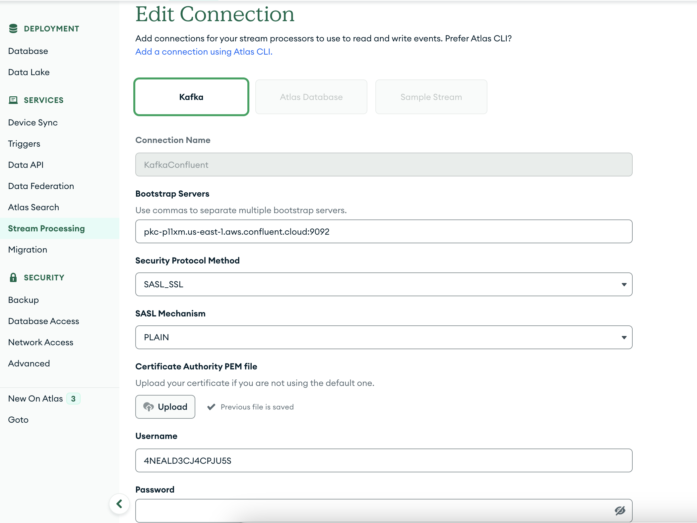
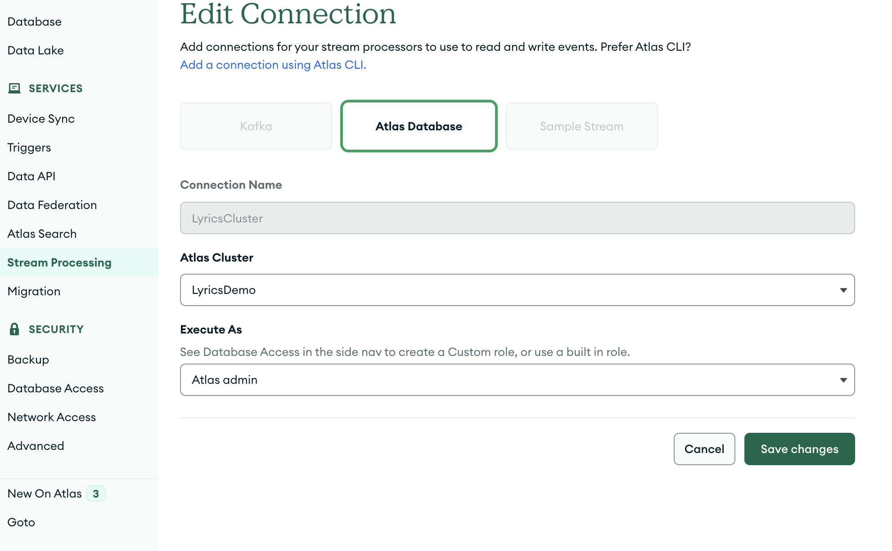
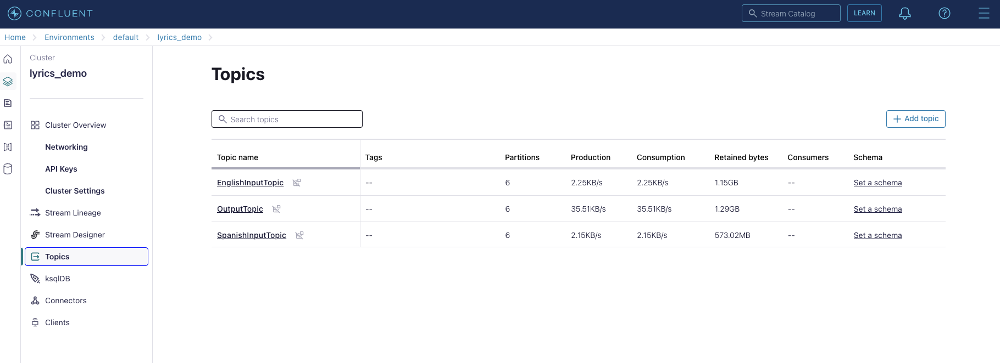
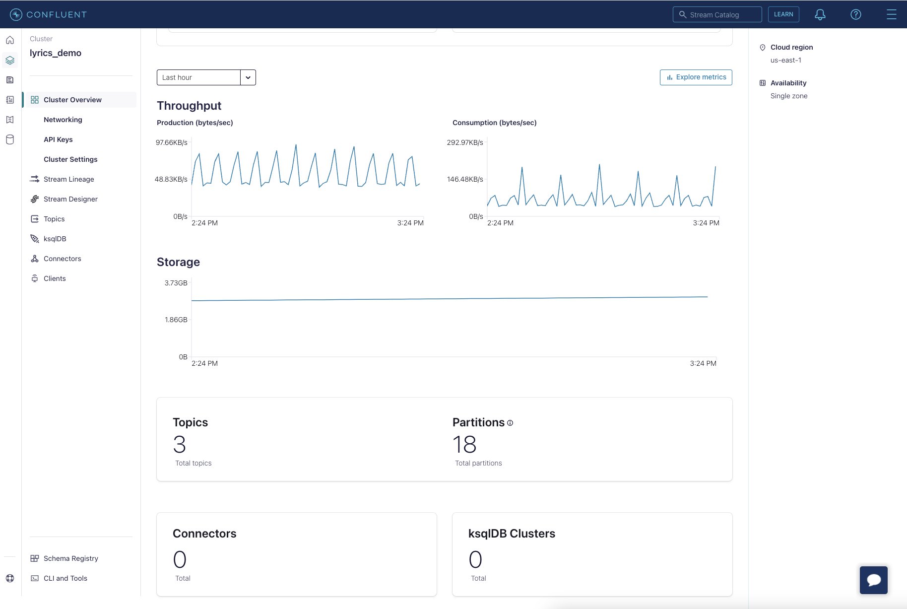
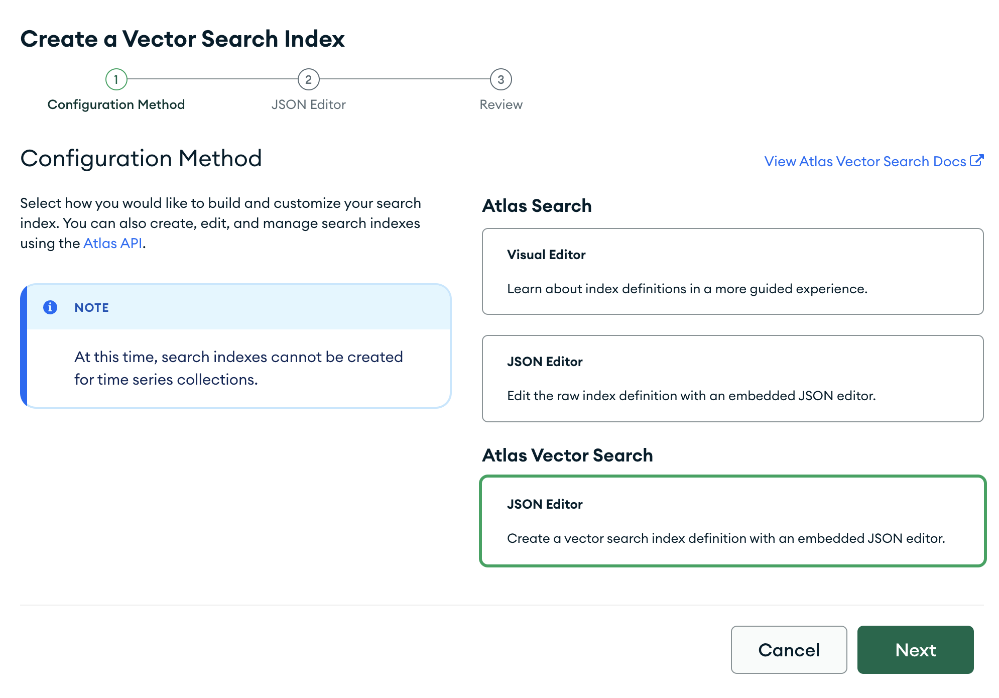

# Scalable Document Embedding with MongoDB Atlas Stream Processing & Vector Search

This repository provides a detailed walkthrough on how to create embeddings for your documents at scale using the powerful combination of MongoDB Atlas Stream Processing and Vector Search. By following this guide, you'll be able to efficiently process large volumes of data and generate high-quality document embeddings that can be easily searched and analyzed.


## Table of Contents:
- [Prerequisites](#prerequisites)
- [Setting up the Environment](#setting-up-the-environment)
- [Loading dataset into the cluster](#loading-dataset-into-the-cluster)
- [Configuring a Kafka Cluster in Confluent](#configuring-a-kafka-cluster-in-confluent)
- [Creating Document Embeddings with MongoDB Atlas Stream Processing and Vector Search](#embedding-creation)
- [Configure the Stream Processing Connection Registry](#configure-the-stream-processing-connection-registry)
- [Configuring Atlas Stream Processing](#configuring-atlas-stream-processing)
- [Launch the processor scripts](#launch-the-processor-scripts)
- [Creating a Vector Search Index](#creating-a-vector-search-index)
- [Searching and Analyzing Large-Scale Documents using Vector Search](#searching-and-analyzing-large-scale-documents-using-vector-search)
- [Conclusion](#conclusion)
- [Additional Resources](#additional-resources)
- [Contributing](#contributing)
- [Acknowledgments](#acknowledgments)


## Prerequisites

- Python 3.8+
- MongoDB Atlas account
- Confluent Cloud Account

## Setting up the Environment

1. **Clone the Repository**:
  ```bash
   git clone https://github.com/dsdlt/mongodb-scalable-document-embeddings.git
   cd mongodb-scalable-document-embeddings
  ```

2. **Set Up a Virtual Environment**:
  ```bash
  python3 -m venv venv
  source venv/bin/activate
  ```
3. **Install Dependencies**:
  ```bash
  pip install -r requirements.txt
  ```
4. **Download the models for Spacy**
  ```bash
  python3 -m spacy download en_core_web_sm 
  python3 -m spacy download es_core_news_sm
  ```

## Loading dataset into the cluster

We have included a script in this repository to download the dataset and restore it into MongoDB

1. **Create an account in MongoDB Atlas**:
We are assuming you have an account in MongoDB Atlas. If not, we recommend you following [this guide](https://www.mongodb.com/docs/guides/atlas/account/)

2. **Load the data in MongoDB**:

This script will ask for MongoDB cluster information and will load the data using  [mongoimport](https://www.mongodb.com/docs/database-tools/mongoimport/)

  ```bash
   ./dataset/data_load.sh
  ```

## Configuring a Kafka Cluster in Confluent

To create a Kafka cluster in Confluent follow the instructions in [their documentation](https://docs.confluent.io/cloud/current/clusters/create-cluster.html#create-ak-clusters)


Once you have created the cluster, go to cluster settings and then copy the bootstrap URL.




Then, create an API key to connect to your cluster.




The next step is to configure the topics that are going to be used in this solution: SpanishInputTopic, EnglishInputTopic and OutputTopic



## Configure the Stream Processing Connection Registry

To configure a new connection, click on the configure button in the Stream Processing cluster, then Connection Registry and add a new connection.

This connection will be created to connect the Atlas Stream Processing instance with the Kafka Cluster.

Once you have created your Kafka cluster, Confluent will provide you with the bootstrap server URL, username and password to use in the Connection Registry.



Next, create a connection from the Atlas Stream Processing instance to the MongoDB cluster.




## Configuring Atlas Stream Processing

Firstly, we will connect to the Atlas Stream Processing instance

```bash
mongosh "mongodb://atlas-stream-sdjfo1nvi1owinf-q123wf.virginia-usa.a.query.mongodb.net/" --tls --authenticationDatabase admin --username username
```

After that, will create a stream processor with a pipeline to filter inserted and updated songs and send only the content of the lyric and the unique id to the corresponding topic in the Kafka cluster.

1. **Stop all previous connections**:

```bash
sp.lyrics_source_cluster.stop()
sp.lyrics_source_cluster.drop()
````
2. **Create the connection to the MongoDB cluster**
````json
lyrics_source_cluster={$source: { connectionName: "LyricsCluster", db: "streamingvectors", coll : "lyrics", config: {fullDocument : 'updateLookup'}}}
````
3. **Create the pipelines for songs in both languages**

````json
only_lyrics_in_english={$match: {operationType: {$in: ["insert", "update"]}, "fullDocument.language": "en", "fullDocument.updated": false}}
only_lyrics_in_spanish={$match: {operationType: {$in: ["insert", "update"]}, "fullDocument.language": "es", "fullDocument.updated": false}}
project_year={$project: {"fullDocument.lyrics": 1, "fullDocument._id": 1}}
send_to_kafka_english={$emit: {connectionName: "KafkaConfluent",topic: "EnglishInputTopic"}}
send_to_kafka_spanish={$emit: {connectionName: "KafkaConfluent",topic: "SpanishInputTopic"}}
````
4. **Create the stream processors using the pipelines**
````json
sp.createStreamProcessor("lyrics_source_cluster_english", [lyrics_source_cluster, only_lyrics_in_english, project_year, send_to_kafka_english])

sp.createStreamProcessor("lyrics_source_cluster_spanish", [lyrics_source_cluster, only_lyrics_in_spanish, project_year, send_to_kafka_spanish])
````
5. **Start processing documents**

```bash
sp.lyrics_source_cluster_english.start()
sp.lyrics_source_cluster_spanish.start()
````
In case you want a list of stream processors you can execute the following command:
```bash
sp.listStreamProcessors()
````
You can filter stream processors by their name:
```bash
sp.listStreamProcessors({name : 'lyrics_source_cluster_english'})
````
Now we will create the connection between the output topic from the Kafka cluster and Stream Processing


1. **Stop all previous connections**

```bash
sp.lyrics_destination_cluster.stop()
sp.lyrics_destination_cluster.drop()
````
2. **Create the connection to the MongoDB cluster**
````json
lyrics_output_topic={$source: { connectionName: "KafkaConfluent", topic: "OutputTopic"}}
````
3. **Create the pipeline to update the documents in MongoDB**:
````json
project_metadata = {$project : {last_updated : '$_ts', _stream_meta: 0}}
update_lyrics_embedding = {
   $merge: {
      into: {
         connectionName: "LyricsCluster",
         db: "streamingvectors",
         coll: "lyrics"
      },
      on: "_id",
      whenMatched: "merge",
      whenNotMatched: "insert"
   }
}
````
4. **Create the stream processors using the pipelines**
```bash
sp.createStreamProcessor("lyrics_destination_cluster", [lyrics_output_topic, update_lyrics_embedding])
````
5. **Start processing documents**
```bash
sp.lyrics_destination_cluster.start()
````

We can preview a stream processor with the following command:
```bash
sp.lyrics_destination_cluster.sample()
````

## Launch the processor scripts
The metadata service is a Python script that will subscribe to their corresponding topic to generate the embeddings using a language specific LLM model and will generate a list of tags based on the contents of the lyrics using the Python library [Spacy](https://spacy.io/)

After processing the document, it will send the event to the Output topic.

1. **Start consuming events from the Kafka topics**
```bash
python3 server/metadataservice.py -l english
python3 server/metadataservice.py -l spanish
````

After executing the metadata service, the messages will start to appear in the Kafka cluster topics.




## Creating a Vector Search Index

You have to create an index in the field lyrics_embeddings which is where the output stream processor will record the embeddings. 



We are using different models for each language to increase the accuracy of the semantic search based on the language. Each model has created a different embeddings lenght so the embeddings is being written into different fields: lyrics_embeddings_es and lyrics_embeddings_en


**Spanish Atlas Vector Search Index**:
`````json
{
  "fields": [
    {
      "type": "vector",
      "path": "lyrics_embeddings_es",
      "numDimensions": 768,
      "similarity": "cosine"
    }
  ]
}
````
**English Atlas Vector Search Index**:

`````json
{
  "fields": [
    {
      "type": "vector",
      "path": "lyrics_embeddings_en",
      "numDimensions": 384,
      "similarity": "cosine"
    }
  ]
}
````

## Searching and Analyzing Large-Scale Documents using Vector Search

There is a Python script to run semantic queries using Atlas Vector Search in a chat interface.

```bash
python3 client/query_client.py
```


## Conclusion

This event driven architecture will allow you to scale horizontally and vertically, adding more workers that consume events from the topics thanks to Atlas Stream Processing.

Additionally, you can regulate the speed at which you write into MongoDB or postponing the update to later on in the day by stopping the processor in Atlas Stream Processing.

```bash
sp.lyrics_destination_cluster.stop()
````

Another benefit of using Atlas Stream Processing and a Kafka cluster is that you can use different models for different types of documents that are more suitable according to the values in the documents (or calculated values from the documents in real time).

## Additional Resources
You can find additional resources in the [MongoDB Developer Center](https://www.mongodb.com/developer/) and the [MongoDB Atlas Solutions Library](https://www.mongodb.com/solutions/solutions-library)

More information about Atlas Vector Search [MongoDB.local NYC 2023 - Vector Search: Powering the Next Generation of Applications](https://www.youtube.com/watch?v=H8EC002zS-0)

More information about Atlas Stream Processing in the [Atlas Stream Processing documentation](https://www.mongodb.com/docs/atlas/atlas-sp/overview/)

More information about language specific models and extension of existing sentence embeddings models to other languages [Making Monolingual Sentence Embeddings Multilingual using
Knowledge Distillation](https://arxiv.org/abs/2004.09813)

Find the original dataset at [Kaggle](https://www.kaggle.com/datasets/carlosgdcj/genius-song-lyrics-with-language-information)


## Contributing

1. Fork the repository on GitHub.
2. Clone the forked repo to your machine.
3. Create a new branch in your local repo.
4. Make your changes and commit them to your local branch.
5. Push your local branch to your fork on GitHub.
6. Create a pull request from your fork to the original repository.

Please ensure that your code adheres to the repo's coding standards and include tests where necessary.

## Acknowledgments

Thanks to Kaggle team and CARLOSGDCJ to share their lyrics dataset at Genius.

MongoDB team for the incredible Atlas Stream Processing and Atlas Vector Search features.

